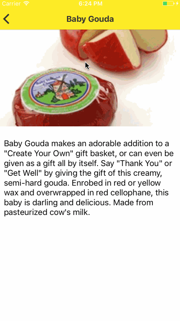

# It's a Cheese-Fest!

This app is a demo of many different ways to make a master-detail app. It's just a list of nice cheeses (Dutch ones so far) skimmed from iGourmet.com and saved into a Firebase database. Use it as a cool way to test frameworks!

The four folders in this repo will allow you to compare the same app built with Flutter, NativeScript, Ionic, and React Native. If you want to use this dataset and format to build the same app with another framework, I accept PRs!

